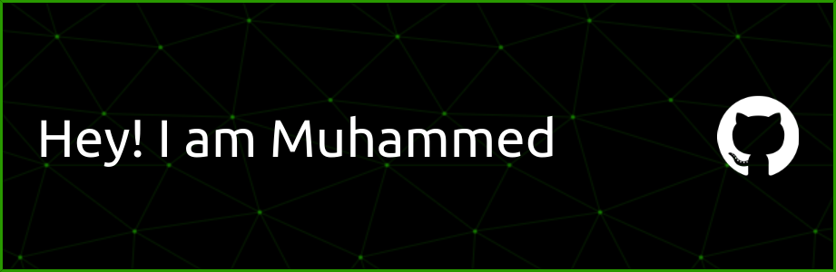

<h1 align="center">Hi 👋, I'm Muhammed Samson</h1>
<h3 align="center">A third-year student at Adama Science and Technology University (ASTU), deeply interested in competitive programming and learning web development. Intrigued by the future of AI and eager to contribute. Committed to continual learning in technology.</h3>

- 🌱 I’m currently learning **React**

- 📫 How to reach me **muhammedsamsoon@gmail.com**

- ⚡ Fun fact **I am Selenophile**

<h3 align="left">Connect with me:</h3>

<h3 align="left">Languages and Tools:</h3>

         

